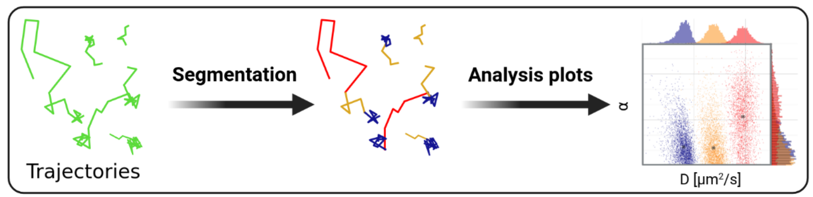

# Purposes

Recent advances in the field of microscopy allow the capture, at nanometer resolution, of the motion of fluorescently-labeled particles in live cells such as proteins or chromatin loci. Therefore, the development of methods to characterize the dynamics of a group of particles has become more than necessary.

`TrackSegNet` is a tool designed for the classification and segmentation of experimental trajectories, specifically those obtained from single-particle tracking microscopy data, into different diffusive states.

- To enable the training of the LSTM neural network, synthetic trajectories are initially generated, and the parameters of the generator can be fine-tuned.

- Upon completion of the training process, the experimental trajectories are classified at each point using the trained model. Subsequently, the trajectories are segmented and grouped based on their respective diffusive states. In this context, "diffusive states" refer to the distinct modes or patterns observed in the movement of particles.

- For each segmented track, the diffusion constant () and anomalous exponent () are further estimated. This is accomplished by computing the mean squared displacement (MSD), providing valuable insights into the dynamic behavior of the particles within each identified diffusive state.

