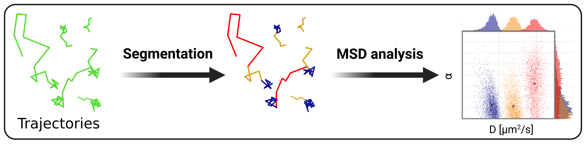

# Summary

`TrackSegNet` is a command-line python program, which permits the classification and segmentation of trajectories into diffusive states. A deep neural network is trained for each particular case using synthetic data and trajectory features as inputs. After classification on the experimental data using the trained network, the trajectories are segmentated and grouped per diffusive state. `TrackSegNet` further estimates the motion parameters (the diffusion constant $D$ and anomalous exponent $\alpha$) for each segmented track using the mean squared displacement (MSD) analysis, and computes additional geometric measurements per tracklet state such as the angular distribution and velocity autocorrelation curve. The resulting segmentation and motion parameters are stored as CSV files. Originally developped for the quantification of protein dynamics using single-particle tracking imaging, its use can be extended to any type of trajectory dataset.

# Statement of need

Recent advances in the field of microscopy allow the capture, at nanometer resolution, of the motion of fluorescently-labeled particles in live cells such as proteins or chromatin loci. Therefore, the development of methods to characterize the dynamics of a group of particles has become more than necessary [@munoz2021]. A typical analysis is the classification and segmentation of trajectories into diverse diffusive states when multiple types of motion are present in a dataset (e.g., confined, superdiffusive) due to the properties of the labeled molecule (e.g., protein bound/unbound to the DNA). A few trajectory classification methods have recently been developed by the community, among which can be cited @wagner2017, @hansen2018, @arts2019, @pinholt2021 and @kabbech2022. However, more practical analysis software is needed for direct application use.

# Method

This software is based on the method of @arts2019 with major improvements and allows replicability on other datasets.

## Neural Network

Tracking particles from 2-dimensional images results in a set $\mathcal{S}$ of trajectories $r_i \in \mathcal{S}$, $i = \left\{1, \dots, P \right\}$,  where $P$ is the total number of trajectories and $r_i(t) = (x_i(t), y_i(t))$ are the 2D coordinates of the particle $i$ at time $t$.

The network is built using functions from the Keras library [@chollet2015], and is composed of a bidirectional long short-term memory (LSTM) layer (having 200 hidden units) followed by a fully connected time-distributed layer with a `SoftMax` activation function. The inputs of the network are of six trajectory features computed beforehand, while the outputs are probabilities for each trajectory point of belonging to one of the $N$ diffusive states, the predicted state is defined by the highest probability.

The computed features along a given trajectory are: the displacements $\Delta x_{\delta=1}$ and $\Delta y_{\delta=1}$ at the first discrete time interval $\delta=1$ (with $\Delta r_\delta (t) = r(t) - r(t+\delta)$), the distances $d_{\delta=1}$ (with $d_\delta (t) = \sqrt{\Delta x_\delta (t)^2 + \Delta y_\delta (t)^2}$), the mean of displacements $\overline{d_{\delta=1,p=1}}$ and $\overline{d_{\delta=2,p=1}}$ (with $\overline{d_{\delta,p}}(t) = \frac{1}{2p+1}\sum_{k=t-p}^{t+p} d_{\delta}(k)$ with $p\geq 1$) and the angles $\theta_{\delta=1}$ between two consecutive displacements. The last feature is an addition to the initial method, used for a better distinction of the trajectory confinement. The first and last trajectory points of each trajectory vector are discarded due to missing computed feature(s).

## Training

The network is trained using synthetic fractional Brownian motion (fBm) trajectories of mixed diffusive states. For this purpose, 10,000 fBm trajectories with a switching mode between states and a total length of 27 frames are generated for each independent training. The fBm process is characterized using the fBm kernel [@lundahl1986] defined as $k_{\text{FBM}}(t) = D\left[\ \lvert t+1\rvert^\alpha  - 2 \lvert t\rvert^\alpha + \lvert t-1\rvert^\alpha\right]$, with $t=\Delta t / \delta$ ($\Delta t$ the time measured between two frames) and the pre-defined motion parameters $m = (D, \alpha)$.

The model is optimized using `Adam` during the training and a categorical cross-entropy loss function.

## Model parameters

The main parameters of the training are tunable from the `params.csv` file to create a new variant of the model:

* `num_states` is an important parameter permitting to decide the number $N$ of diffusive states. This number can vary from 2 to 6 states, but it is recommended to choose 2 to 4 states.
* `state_i_diff` and `state_i_alpha` the approximate motion parameters $m$ for each of the $N$ diffusive state. The diffusion constant $D$ is dimensionless, and the anomalous exponent value $\alpha$ is ranging from 0 to 2 (]0-1[: subdiffusion, 1: Brownian motion, ]1-2[: superdiffusion).
* `pt_i_j` the probability of transitionning from the state i to the state j. The total number of probabilities should be $N^2$.

The remaining parameters are related to the experimental dataset:

* `data_path`, the path of the dataset of trajectories to segment.
* `track_format`, the format of the files containing the trajectory coordinates, either `MDF` (see `MTrackJ` data file format) or `CSV`
* `time_frame`, the time interval between two trajectory points in seconds.
* `pixel_size`, the dimension of a pixel in $\mu m$.

## Classification and MSD analysis

Before computing the features for each experimental trajectory, gaps in trajectories of length 1 are filled by a randomly generated point; while the larger gaps are split in two separate trajectories. Each point is therefore classified as one of the $N$ diffusive states using the trained LSTM model. Based on the state classification, the trajectories are segmented and the motion parameters are estimated for each segmented track (longer than 5 frames) using the MSD analysis. The latter consists of applying a least-square fit from the logarithm form of the MSD power-law equation [@metzler2014]. Both $D$ and $\alpha$ distributions can be plotted in a scatterplot as shown in \autoref{fig:pipeline}. The new probability transition matrix and proportion of tracklet points in each diffusive state are also calculated.

# Acknowledgements

We would like to thanks Selçuk Yavuz and Martin E. van Royen for sharing SPT data used as a toy example, and Maarten W. Paul for testing the software and fixing minor mistakes. \autoref{fig:pipeline} was partially created using Biorender. This work was supported by the Dutch Research Council (NWO) through the Building Blocks of Life research program (GENOMETRACK project, Grant No. 737.016.014).

# References

